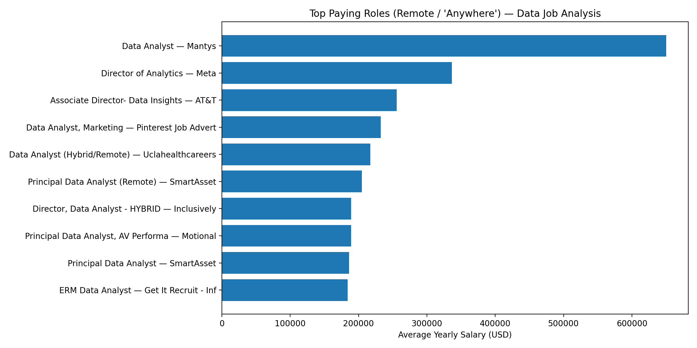

# SQL_Project_Data_Job_Analysis

## Introduction
This project explores the data job market using SQL. The goal is to answer practical questions such as:
- What are the top-paying Data Analyst roles?
- Which skills are most demanded in job postings?
- Which skills are associated with higher salaries?
- What skills should someone learn to improve job opportunities and earning potential?

The analysis is written as a set of SQL scripts that can be run to reproduce the results.

---

## Background
The demand for data roles is growing, but job requirements and salaries vary widely by company, location, and skill set.  
This project uses job posting data to analyze:
- Salary trends for Data Analyst roles
- High-value skills that correlate with higher pay
- In-demand skills appearing frequently in postings

---

## Tools I Used
- **SQL**: querying, joining tables, filtering, aggregations, and ranking
- **Database**: PostgreSQL
- **VS Code**: writing and organizing SQL scripts

---

## The Analysis
The repository is organized into two main parts:

- **SQL_Load/**: scripts to create tables and load/import data (if included). :contentReference[oaicite:1]{index=1}  
- **SQL_Quarries/**: the main analysis queries (5 SQL scripts). :contentReference[oaicite:2]{index=2}  

### 1) Top Paying Jobs
### 1) Top Paying Jobs (Remote / "Anywhere")

This query identifies the **top 10 highest-paying roles** in the dataset for jobs tagged as **Data Analyst** with location set to **"Anywhere"** (remote), while excluding rows with missing salary values.  
It also joins company information to make the results more readable and useful.

#### Why this matters
When people search for “Data Analyst” roles, they often assume the title reflects a standard salary range.  
But the data shows something different: **high-paying jobs can appear under analyst titles**, and the top salaries can be extreme outliers compared to the rest of the market.

---

#### Visual 1 — Top Paying Roles (Salary Ranking)
This chart ranks the **top 10 remote roles** by average yearly salary.  
You can quickly see which job titles and companies dominate the top end.

---

#### Visual 2 — Salary Spread (How wide is the gap?)
This chart shows the **salary distribution across the top 10**.  
It highlights how the #1 role is a major outlier and how salaries drop sharply after the first few roles.

---

#### Visual 3 — Degree Requirement Signal
A useful detail in the dataset is whether the posting **mentions a degree requirement**.
In the top-paying set, some roles **do not mention a degree**, which can signal skills-first hiring.

---

#### Key takeaways
- The top-paying “Data Analyst” market includes **senior titles** (Director / Principal), not only entry-level analyst roles.
- Salaries in the top 10 show a **large spread**, meaning a small number of roles drive the extreme high end.
- Some top-paying postings **do not mention a degree requirement**, suggesting that experience + skills can matter more than formal education in certain roles.

> Next step: connect these top-paying roles to skills to see **which tools/skills appear most often** in high-salary jobs.

### 2) Top Paying Job Skills
**File:** `2 - Top Paying Job Skills.SQL`  
**Question:** What skills are required for the highest paying Data Analyst roles?  
**Approach:** Take the top-paying jobs and join them with skills tables to find the most common skills among them.

### 3) Top Demanding Skills
**File:** `3 - Top Demanding Skills.SQL`  
**Question:** Which skills appear most frequently in Data Analyst job postings?  
**Approach:** Count skill frequency across postings and rank the most demanded skills.

### 4) Top Skills Based on Salary
**File:** `4 - Top Skills Based on Salary.SQL`  
**Question:** Which skills are associated with higher average salaries?  
**Approach:** Group postings by skill and compute average salary per skill, then rank descending.

### 5) Top Skills to Learn
**File:** `5 - Top Skills to learn.SQL`  
**Question:** Which skills are both high-demand and high-paying (best ROI skills)?  
**Approach:** Combine (demand frequency) + (average salary) to highlight skills that maximize job opportunities and pay.

---

## What I Learned
- How to structure a SQL analysis project into reusable scripts (loading vs analysis).
- How to use joins effectively to connect job postings, companies, and skill requirements.
- How filtering choices (e.g., remote roles, non-null salary) impact analysis quality.
- How to use aggregation + ranking to turn raw job postings into actionable insights.

---

## Conclusions
This project demonstrates how SQL can be used to analyze the job market and extract insights that help:
- Job seekers understand what skills matter most
- Analysts prioritize which skills to learn next
- Hiring teams benchmark skill requirements and salary patterns
